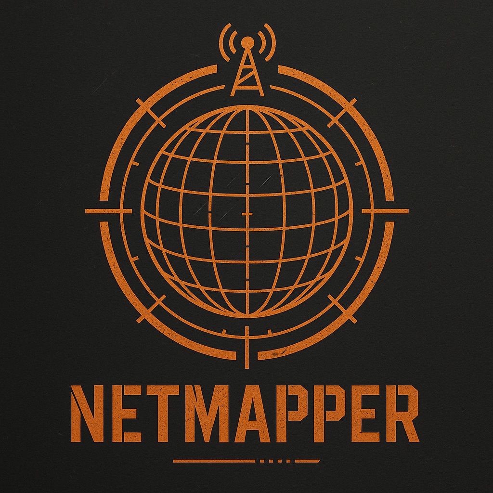

# Netmapper

## Install and Run
### Linux
```bash
git clone https://github.com/ethanspock/netmapper.git
cd netmapper/app/
python3 -m venv netmapper
source netmapper/bin/activate
pip install -r requirements-linux.txt
python3 app.py
```
### Windows
```powershell
# Optional prerequisites (use winget; restart shell after installs)
winget install -e --id Python.Python.3.11
winget install -e --id Npcap.Npcap            # needed for passive listener
winget install -e --id Nmap.Nmap              # optional, for Nmap scans

# Set up virtual environment and install deps
git clone https://github.com/ethanspock/netmapper.git
cd netmapper\app\
py -3 -m venv netmapper
. netmapper\Scripts\Activate.ps1
python -m pip install --upgrade pip
pip install -r requirements-windows.txt

# Run the app
python app.py
```


## Overview

- Scans an IPv4 subnet (CIDR) using OS ping for host discovery.
- Pulls MAC addresses from the ARP cache to enrich results.
- Builds a layered tree topology: subnet → gateway → typed hosts.
- Visualizes with networkx + matplotlib embedded in Tkinter using device icons.
 - Adds layered router grouping so hosts appear under their inferred router.

## Setup

- Requires Python 3.9+.
- Install dependencies:
  - `pip install -r netmapper_gui/requirements.txt`

## Run

- `python netmapper_gui/app.py`
- Click “Use Local” to auto-fill your first private IPv4 subnet.
- Optionally enable “Reverse DNS” to attempt hostnames.
- Click “Scan” to discover hosts and render the map.

## Notes

- Windows: scanning uses `ping`, `arp -a`, and `route print` under the hood.
- Reverse DNS can be slow if PTR records are missing; leave off for speed.
- ARP cache only reflects local L2 segment; MACs may be missing for remote subnets.
- You do not need admin for ping/arp on Windows.
 - The app now includes a Matplotlib toolbar (zoom/pan) and export buttons.

## Icon Mapping (Heuristic)

- Network: hexagon, blue.
- Gateway: triangle up, gold.
- Router: triangle up, orange (if inferred by name/IP).
- Switch: square, blue.
- Access Point: triangle down, teal.
- Server: pentagon, purple.
- NAS: diamond, cyan.
- Printer: diamond, gray.
- Camera: octagon, dark gray.
- VM: circle, light blue.
- PC/Unknown: circle, green/gray.

Classification uses simple hostname/MAC/IP hints (no OUI DB). Edit `netmapper_gui/device_classifier.py` to tweak rules.

## Export

- PNG: saves the current graph view.
- CSV: ip, alive, rtt_ms, hostname, mac, type.
- JSON: includes subnet, gateway, and host records with type.

Roadmap Ideas

- Add Nmap integration for richer port/service detection.
- SNMP (and LLDP/CDP) to infer real L2/L3 links.
- Local ARP sweep or Scapy (requires admin/raw sockets) for deeper discovery.
- Export results to JSON/CSV and save graph images.
- Filter by alive/RTT and subnet presets per interface.
 - Toggle between spring layout and tree layout.
